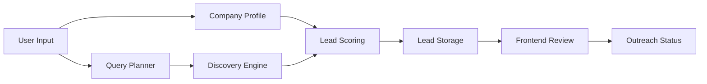
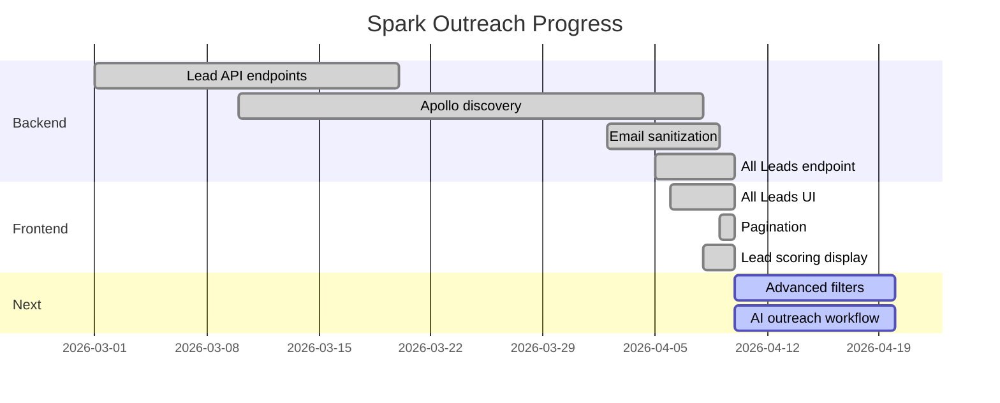

# Spark Outreach

Spark Outreach is a local SaaS-style outreach platform built with FastAPI, MongoDB, and React. It combines company profile enrichment, query-driven lead discovery, semantic embeddings, AI-assisted scoring, and a modern admin UI.

## What it does

- Stores company profile data, services, technologies, industries, and target locations
- Discovers leads using search queries, Apollo/SerpAPI, and website enrichment
- Filters and scores leads by company fit, signal strength, and query relevance
- Persists discovered leads in MongoDB for review and campaign workflows
- Provides a React dashboard for search, lead review, and outreach tracking
- Includes an `All Leads` page that loads leads directly from the database

## Key features

- FastAPI backend with MongoDB persistence
- React + TypeScript frontend with authenticated dashboard
- Company profile and campaign setup flows
- Lead discovery, scraping, enrichment, and scoring
- Pagination on `All Leads` for 50-lead page increments
- Apollo-only discovery mode when `APOLLO_API_KEY` is configured
- Email sanitization and response validation for lead data

## Architecture

### Backend

- `backend/app/main.py` — FastAPI startup and router registration
- `backend/app/config.py` — environment-backed configuration
- `backend/app/database.py` — MongoDB connection setup
- `backend/app/routers/` — endpoints for auth, campaigns, companies, leads, and AI
- `backend/app/services/` — business logic for discovery, scoring, embeddings, and scraping
- `backend/app/models/` — MongoDB document definitions
- `backend/app/schemas/` — Pydantic request/response models
- `backend/app/utils/` — helpers for auth, response serialization, embeddings, and scraping

### Frontend

- `src/main.tsx` — app bootstrap
- `src/App.tsx` — route definitions and protected layout
- `src/pages/` — page-level UI for dashboard, search, results, leads, campaign, company setup, and settings
- `src/components/` — reusable UI and dashboard layout components
- `src/services/api.ts` — centralized API client
- `src/hooks/` — custom React hooks like toast handling

## Environment variables

Create `backend/.env` with values such as:

```env
MONGO_URL=mongodb://localhost:27017
MONGO_DB_NAME=spark_outreach
SECRET_KEY=your-secret-key
GEMINI_API_KEY=
GROQ_API_KEY=
APOLLO_API_KEY=
SERPAPI_KEY=
SERPER_API_KEY=
HF_API_KEY=
REDIS_URL=
```

Important backend settings:

- `MONGO_URL` — MongoDB connection string
- `APOLLO_API_KEY` — Apollo discovery key (when set, Apollo-only discovery mode is used)
- `SERPAPI_KEY` / `SERPER_API_KEY` — search provider keys for fallback discovery
- `GEMINI_API_KEY` / `GROQ_API_KEY` — LLM provider credentials for query planning and messaging

## Frontend routes

- `/dashboard` — main dashboard
- `/company-setup` — company profile builder
- `/search` — lead search and discovery workflow
- `/leads` — search results page
- `/all-leads` — new page that loads saved leads from the database
- `/lead/:id` — lead detail view
- `/settings` — app settings and embedding checks

## API endpoints

- `POST /api/v1/auth/login` — login
- `GET /api/v1/auth/me` — current user
- `GET /api/v1/leads/all` — fetch all leads for current user (supports `skip`, `limit`, `status`)
- `POST /api/v1/leads/search` — search scored leads
- `GET /api/v1/leads/{lead_id}` — lead detail
- `GET /api/v1/leads/campaign/{campaign_id}` — campaign leads

## New `All Leads` workflow

The `All Leads` page loads leads directly from the DB through the backend route `GET /api/v1/leads/all`. It supports incremental pagination in 50-lead chunks, so you can fetch the first 50 results and click `Load More` for additional pages.

## Local development

### Backend

```bash
cd backend
python -m venv venv
venv\Scripts\activate
pip install -r requirements.txt
python -m uvicorn app.main:app --reload --host 127.0.0.1 --port 8000
```

### Frontend

```bash
cd ..
npm install
npm run dev
```

Open the frontend at the Vite URL shown in the terminal, typically `http://localhost:5173`.

## Recommended workflow

1. Start backend and frontend locally.
2. Register or log in via the frontend.
3. Complete company profile data in `Company Setup`.
4. Create a campaign or use an existing one.
5. Use `Lead Search` to discover leads.
6. Review results in `Leads`, then use `All Leads` to browse stored database leads.
7. Mark outreach status and refine your search criteria.

## Current progress

### What is implemented now

- `All Leads` page is live and supports 50-lead pagination
- `GET /api/v1/leads/all` fetches saved leads from MongoDB
- Apollo-only discovery mode is active when `APOLLO_API_KEY` is configured
- Lead scoring now includes `company_fit_score`, `signal_score`, and `signal_keywords`
- Email sanitization and response validation are fixed for malformed values
- Frontend shows lead detail, copy email, and filtering controls

### What is working today

- campaign and company profile flows
- lead discovery with backend scoring
- lead detail and outreach tracking
- incremental lead loading from database

### Current roadmap

- improve query planning and Apollo search reliability
- add more frontend filters for status and company fit
- add structured lead export or bulk actions
- extend AI message generation and follow-up workflows

## Workflow diagrams

### System workflow



### Progress status



## Notes

- If `APOLLO_API_KEY` is configured, the backend prefers Apollo for discovery and skips SerpAPI fallback.
- Lead responses now sanitize email fields for invalid values such as URL-wrapped addresses.
- The application stores lead scoring values (`company_fit_score`, `signal_score`, `signal_keywords`) so the UI can display fit and signal metrics.

## Contact

For updates or troubleshooting, inspect the backend router and service files:

- `backend/app/routers/leads.py`
- `backend/app/services/lead_service.py`
- `backend/app/services/apollo_service.py`
- `src/pages/AllLeads.tsx`
- `src/services/api.ts`

---

## Setup Instructions

### Backend

```powershell
cd backend
python -m venv .venv
.\.venv\Scripts\Activate.ps1
pip install -r requirements.txt
```

Create or update `backend/.env` with the following values:

```env
APP_NAME=Spark Outreach API
DEBUG=True
MONGO_URL=mongodb://localhost:27017
MONGO_DB_NAME=spark_outreach
SECRET_KEY=your-secret-key
ACCESS_TOKEN_EXPIRE_MINUTES=30
GEMINI_API_KEY=
OPENAI_API_KEY=
HF_API_KEY=
SERPAPI_KEY=
SERPER_API_KEY=
REDIS_URL=
```

Notes:
- `SERPAPI_KEY` is required for lead discovery and search discovery results.
- `HF_API_KEY` is optional for Hugging Face inference access.
- `HF_TOKEN` can also be used to speed up model downloads from Hugging Face.

Run the backend:

```powershell
python -m uvicorn app.main:app --reload --host 127.0.0.1 --port 8000
```

### Frontend

```bash
npm install
npm run dev
```

Open the Vite URL shown in the terminal, usually `http://localhost:5173`.

---

## API Overview

### Authentication

- `POST /api/v1/auth/register`
- `POST /api/v1/auth/login`
- `GET /api/v1/auth/me`

### Company profile

- `POST /api/v1/company/profile`
- `GET /api/v1/company/profile`
- `PUT /api/v1/company/profile`
- `POST /api/v1/company/profile/generate-embeddings`
- `POST /api/v1/company/profile/query`
- `POST /api/v1/company/profile/generate-icp`
- `POST /api/v1/company/profile/complete-setup`

### AI

- `POST /api/v1/ai/rag-search`
- `POST /api/v1/ai/generate-message`
- `POST /api/v1/ai/create-embeddings`

### Campaigns and leads

- Campaign and lead routes are exposed under `/api/v1/campaigns` and `/api/v1/leads`
- Lead discovery/search endpoint: `POST /api/v1/leads/search`

---

## Embedding & AI Details

- Uses local semantic embeddings with `paraphrase-mpnet-base-v2`
- Company profile embeddings are generated from profile fields, services, expertise, technologies, industries, and portfolio content
- Lead discovery embeds website content and discovery context for better match quality
- Search ranking prioritizes company profile fit before query relevance
- Optional AI completion uses Gemini or OpenAI if keys are configured

---

## Troubleshooting

- If you see HF Hub warnings or slow model downloads, set `HF_TOKEN` in the environment
- If lead discovery fails with network `403` or SSL errors, your environment may be blocking outbound requests
- Ensure `SERPAPI_KEY` is present for search-based lead discovery
- Verify both backend and frontend are running during development
- Check `backend/app/config.py` for supported environment variables and default values

---

## Project Structure

- `backend/` — backend Python application
- `src/` — React frontend source
- `public/` — static assets
- `package.json` — frontend dependencies and scripts
- `backend/requirements.txt` — Python dependencies
- `README.md` — project documentation

---

## Notes

- The system is tuned to avoid low-value search results and prioritize actual business websites.
- The discovery pipeline now generates provider-focused queries for industry-specific services.
- For lead search, the system uses both company profile embeddings and business signal detection to improve relevance.
- Use the frontend company setup flow to populate services, expertise, and target industries for better matching.
