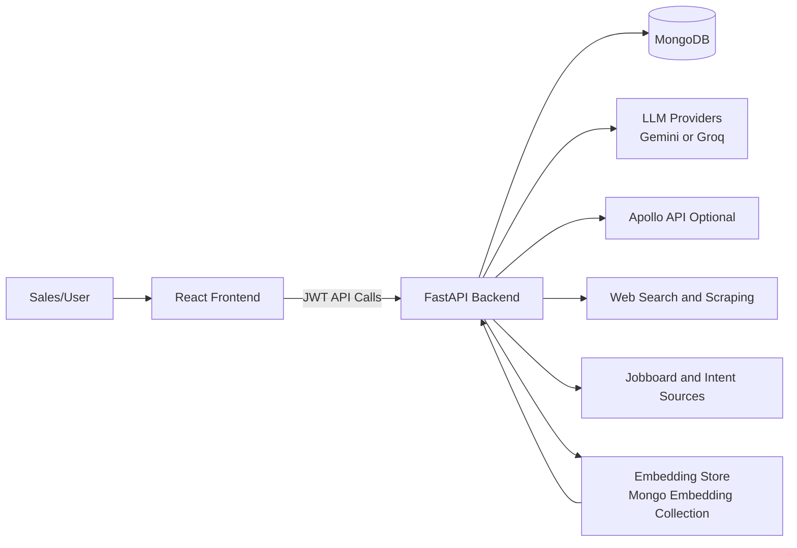
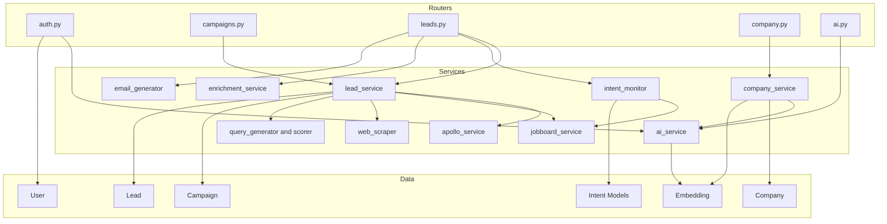
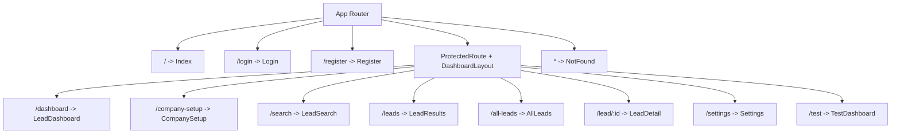
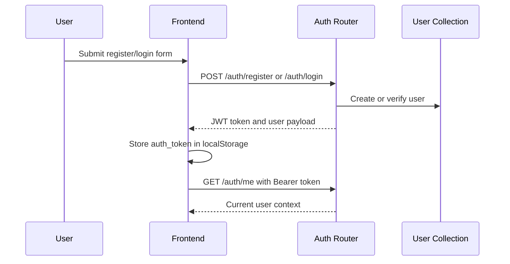
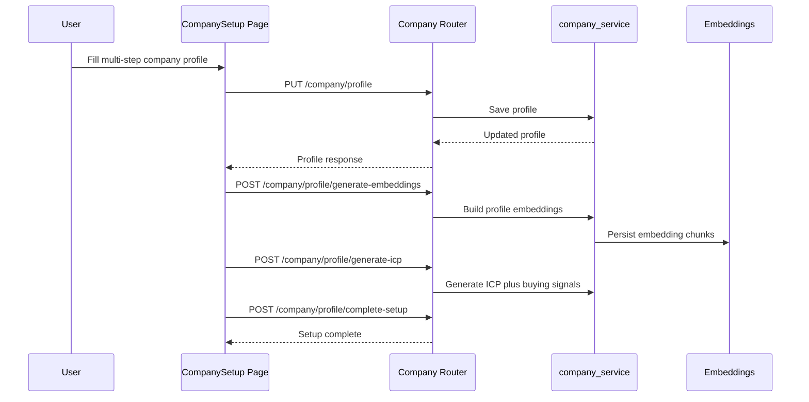
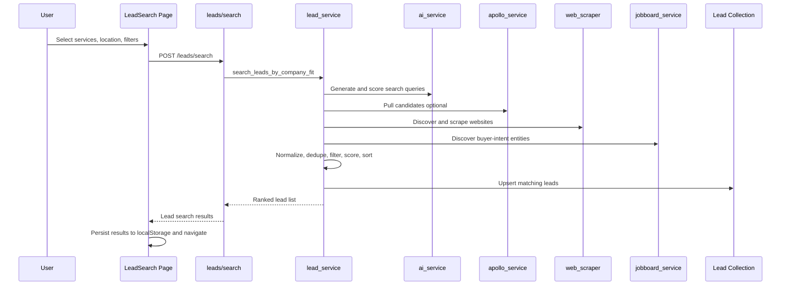
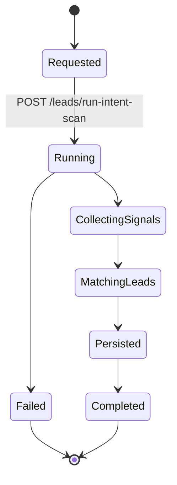
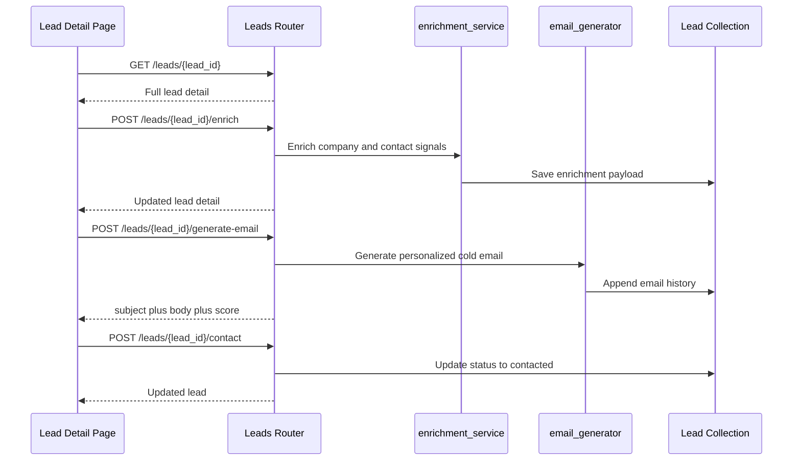
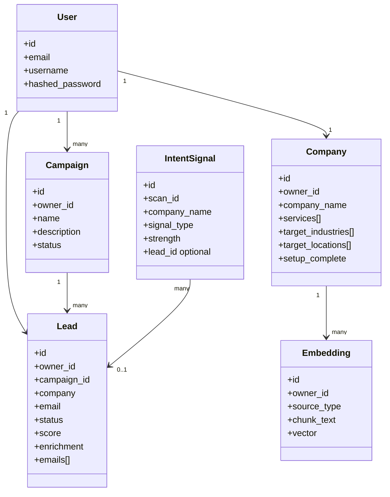

# Spark Outreach

<div align="center">

[](https://react.dev/)
[](https://fastapi.tiangolo.com/)
[](https://www.mongodb.com/)
[](https://www.typescriptlang.org/)
[](https://vitejs.dev/)
[]()

**AI-assisted buyer-intent lead discovery, qualification, enrichment, and outreach platform**

***Define your service profile, discover real buying signals, score fit, enrich lead intelligence, and generate personalized outbound in one system.***

</div>

---

Spark Outreach is a full-stack lead generation and outreach system for service businesses. It combines company-context intelligence, multi-source discovery, scoring, enrichment, and AI workflows into a single operator experience.

This README is a source-verified, implementation-level technical report for product, engineering, and delivery teams.

## Core Functionality

| Area | Capability |
| --- | --- |
| Company Intelligence | Multi-step company setup with services, ICP context, profile embeddings, and generated buyer signals |
| Lead Discovery | Multi-source lead discovery using Apollo (optional), web discovery, and intent signal monitoring |
| Lead Qualification | Scorecards with fit, intent, and signal dimensions; hot-lead extraction |
| Lead Operations | Full lead lifecycle: create, bulk create, update, contact, delete, campaign filtering |
| Outreach | AI-generated cold email and message workflows with lead-level history |
| Monitoring | Async intent scan start, status polling, and detected signal retrieval |
| AI Platform | RAG retrieval, campaign embedding generation, and message generation endpoints |

## Key Highlights

- Full-stack implementation: React + TypeScript + FastAPI + MongoDB.
- Authenticated multi-user workflow with JWT-protected APIs.
- End-to-end lead workflow from profile setup to outreach execution.
- Multi-provider lead and signal ingestion with ranking and filtering.
- Clear service-oriented backend architecture with modular routers and services.
- Ready for iterative production hardening (env-driven config, health checks, test stack).

## Complete Workflow (High Level)

```text
1) Authenticate User
  -> 2) Complete Company Setup
  -> 3) Generate Embeddings + ICP Signals
  -> 4) Run Lead Discovery and Intent Scan
  -> 5) Score, Filter, and Review Leads
  -> 6) Enrich Lead Intelligence
  -> 7) Generate Outreach and Track Contact
```

## Table of Contents

1. Executive Summary
2. Product Capabilities
3. System Architecture
4. Core Workflows
5. API Surface (Complete)
6. Frontend Features and Screens
7. Backend Services and Internal Logic
8. Data Model Overview
9. Configuration and Environment
10. Local Setup and Development Commands
11. Quality Assurance and Testing
12. Operational Notes and Known Gaps
13. Repository Map

## 1) Executive Summary

Spark Outreach supports the end-to-end flow below:

1. User authentication and protected workspace.
2. Company profile setup with services, industries, locations, and portfolio context.
3. Company context embedding and ICP signal generation.
4. Lead discovery using:
   - Apollo (optional)
   - Web discovery and scraping
   - Buyer-intent signal monitoring
5. Lead ranking using fit plus signal scoring.
6. Lead detail drill-down, enrichment, and cold email generation.
7. Continuous intent scans to identify fresh opportunities.

Primary stack:

- Frontend: React 18, TypeScript, Vite, React Router, TanStack Query, Tailwind + shadcn UI, Framer Motion.
- Backend: FastAPI, MongoEngine, MongoDB, JWT auth, async services.
- AI and retrieval: Gemini and Groq provider support, embeddings and RAG endpoints.

## 2) Product Capabilities

### 2.1 Capability Matrix

| Capability Area | Feature | Status | User Surface | Backend Surface | How It Works |
| --- | --- | --- | --- | --- | --- |
| Identity and Access | Register/Login/Profile | Production | Login/Register + protected routes | /auth/* | JWT token is issued, stored as auth_token, and attached to API requests |
| Company Intelligence | Company profile create/read/update | Production | Company Setup wizard | /company/profile | Wizard persists profile data, then uses profile as lead-search context |
| Company Intelligence | Generate profile embeddings | Production | Company Setup finalization | /company/profile/generate-embeddings | Profile text is vectorized for contextual retrieval |
| Company Intelligence | Generate ICP and signals | Production | Company Setup finalization | /company/profile/generate-icp | Backend derives target ICP and signal definitions from profile |
| Campaigns | Campaign CRUD and start | Production | Campaign pages and test tools | /campaigns/* | Campaigns are owned by current user and drive lead-scoped operations |
| Lead Discovery | Multi-source lead search | Production | Search Leads page | /leads/search | Query planning + source fetch + filtering + dedupe + scoring |
| Lead Discovery | Hot leads list | Production | All Leads tab | /leads/hot | Returns high-priority leads using stored scorecard signals |
| Lead Operations | Lead CRUD + status updates | Production | Lead views | /leads/* | Supports create, bulk, update, contact mark, delete |
| Lead Intelligence | Enrichment | Production | Lead Detail | /leads/{lead_id}/enrich | Adds tech stack, signal strength, and decision-maker hints |
| Outreach | Cold email generation | Production | Lead Detail | /leads/{lead_id}/generate-email | AI generates personalized outreach and stores history |
| Intent Monitoring | Start and monitor intent scan | Production | Test Dashboard and integrated flows | /leads/run-intent-scan, /leads/scan-status, /leads/intent-signals | Async scan detects buyer-intent signals and links to leads |
| AI Tools | RAG search and message generation | Production | API and feature integration | /ai/* | Uses embeddings and model providers for retrieval and generation |
| Analytics Dashboard | Executive dashboard visuals | Demo UI | Lead Dashboard | N/A for most widgets | Current dashboard cards/charts are sample data for UX framing |
| LinkedIn Phase-5 UI | Sequence/connection controls in test page | Experimental UI | Test Dashboard | Not fully implemented in current routers | UI scaffolding exists, full API contract not yet present |

### 2.2 Service Portfolio Coverage

The platform currently supports broad service taxonomy search inputs, including:

- Web App Development
- Mobile App Development
- eCommerce Web Development
- eCommerce App Development
- Product Development
- MVP Development
- Microsoft MAUI
- Salesforce Development
- Business Application Development
- Microsoft Power Pages
- Microsoft Power Apps
- Microsoft Power Automate
- Microsoft Power BI
- Microsoft Copilot Studio
- Microsoft Fabric
- Digital Transformation
- Power Platform Adoption
- Azure Consulting
- DevOps Consulting and Engineering
- Cloud Migration
- InfoPath to Power Apps
- Microsoft Dynamics 365
- Data Engineering
- UI/UX Design
- Cybersecurity
- AI/ML Development

## 3) System Architecture

### 3.1 Context Architecture



### 3.2 Backend Component Diagram



### 3.3 Frontend Route Map



## 4) Core Workflows

### 4.1 Authentication Workflow



### 4.2 Company Setup Workflow



### 4.3 Lead Discovery Workflow



### 4.4 Intent Monitoring Workflow



### 4.5 Enrichment and Outreach Workflow



## 5) API Surface (Complete)

Base URL: http://localhost:8000/api/v1

### 5.1 Auth

| Method | Path | Auth Required | Purpose |
| --- | --- | --- | --- |
| POST | /auth/register | No | Create user account |
| POST | /auth/login | No | Authenticate and issue JWT |
| GET | /auth/me | Yes | Get current user profile |

### 5.2 Campaigns

| Method | Path | Auth Required | Purpose |
| --- | --- | --- | --- |
| POST | /campaigns | Yes | Create campaign |
| GET | /campaigns | Yes | List campaigns |
| GET | /campaigns/{campaign_id} | Yes | Campaign detail |
| PUT | /campaigns/{campaign_id} | Yes | Update campaign |
| POST | /campaigns/{campaign_id}/start | Yes | Start campaign |
| DELETE | /campaigns/{campaign_id} | Yes | Delete campaign |

### 5.3 Leads

| Method | Path | Auth Required | Purpose |
| --- | --- | --- | --- |
| POST | /leads/search | Yes | Multi-source lead discovery and ranking |
| POST | /leads/run-intent-scan | Yes | Start intent scan async |
| GET | /leads/scan-status | Yes | Poll status for scan |
| GET | /leads/intent-signals | Yes | Get detected signals |
| POST | /leads | Yes | Create single lead |
| POST | /leads/bulk | Yes | Bulk create leads |
| GET | /leads/all | Yes | List all owned leads |
| GET | /leads/hot | Yes | List high-priority leads |
| GET | /leads/campaign/{campaign_id} | Yes | List leads by campaign |
| GET | /leads/{lead_id} | Yes | Lead detail |
| PUT | /leads/{lead_id} | Yes | Update lead |
| POST | /leads/{lead_id}/contact | Yes | Mark contacted / update state |
| POST | /leads/{lead_id}/generate-email | Yes | Generate outreach email |
| POST | /leads/{lead_id}/enrich | Yes | Enrich lead intelligence |
| DELETE | /leads/{lead_id} | Yes | Delete lead |

### 5.4 AI

| Method | Path | Auth Required | Purpose |
| --- | --- | --- | --- |
| POST | /ai/rag-search | Yes | Semantic retrieval from embedding store |
| POST | /ai/generate-message | Yes | AI message generation |
| POST | /ai/create-embeddings | Yes | Campaign embedding generation |

### 5.5 Company

| Method | Path | Auth Required | Purpose |
| --- | --- | --- | --- |
| POST | /company/profile | Yes | Create company profile |
| GET | /company/profile | Yes | Get profile |
| PUT | /company/profile | Yes | Update profile |
| POST | /company/profile/generate-embeddings | Yes | Build company embeddings |
| POST | /company/profile/query | Yes | Query profile context |
| POST | /company/profile/generate-icp | Yes | Generate ICP and buying signals |
| POST | /company/profile/complete-setup | Yes | Mark setup complete |

### 5.6 System

| Method | Path | Auth Required | Purpose |
| --- | --- | --- | --- |
| GET | / | No | Service root info |
| GET | /health | No | Health and DB status |

## 6) Frontend Features and Screens

### 6.1 Routed Screens in Active Navigation

| Route | Page | Purpose | Data Source |
| --- | --- | --- | --- |
| / | Index | Landing page and entry point | Static UI |
| /login | Login | User sign-in | /auth/login |
| /register | Register | User signup | /auth/register |
| /dashboard | LeadDashboard | Dashboard and summary cards | Mostly sample/demo data in current implementation |
| /company-setup | CompanySetup | Company profile wizard and intelligence setup | /company/* |
| /search | LeadSearch | Build intent-aware lead search query | /leads/search |
| /leads | LeadResults | Immediate search result review | localStorage from search response |
| /all-leads | AllLeads | Persistent database lead list and hot leads | /leads/all and /leads/hot |
| /lead/:id | LeadDetail | Lead intelligence, enrichment, email generation | /leads/{id}, enrich, generate-email |
| /settings | Settings | Account and app settings UI | Varies |
| /test | TestDashboard | Advanced testing surface for phase flows | Mixed live and experimental endpoints |

### 6.2 Additional Page Files Present

The following pages exist in source but are not currently mounted in active routing:

- AILearning
- Analytics
- Campaigns
- Dashboard
- LeadSettings
- NewCampaign
- Prospects
- ReviewQueue

### 6.3 Feature Behavior Details

#### Company Setup

- Loads existing profile on mount.
- Saves progress per step via profile update.
- Final completion runs a pipeline: save profile, generate embeddings, generate ICP, mark complete.

#### Search Leads

- User picks location, services, and filters.
- UI runs a staged progress sequence to communicate process status.
- Submits query and filters to /leads/search.
- Stores response in localStorage and redirects to /leads.

#### Lead Results

- Reads localStorage payload generated by search.
- Supports filtering by priority/status and sorting by quality/company/date.
- Offers quick actions for copy email, open details, mark contacted UI action.

#### All Leads

- Pulls persisted leads from database.
- Separates hot leads into dedicated tab.
- Supports pagination and advanced score breakdown expansion.

#### Lead Detail

- Fetches enriched lead details.
- Displays scoring dimensions and reasons.
- Supports cold email generation and email history.
- Supports contact-ready details including fallback from enrichment payload.

#### Test Dashboard

- Includes Phase-2 intent scan actions and polling.
- Includes Phase-5 LinkedIn UI scaffolding.
- Some controls point to endpoints that are not fully implemented in current backend routers.

## 7) Backend Services and Internal Logic

| Service | Main Responsibility | Inputs | Outputs |
| --- | --- | --- | --- |
| ai_service | Query planning, message generation, embeddings, retrieval | Campaign/profile context and prompts | Ranked queries, generated text, vectors |
| lead_service | Main discovery orchestrator | Query + filters + user context | Ranked lead list, saved lead docs |
| apollo_service | Apollo provider integration | Search criteria and API key | Candidate companies and contacts |
| web_scraper | Web discovery and page signal extraction | Search terms and domains | Candidate intent records |
| jobboard_service | Buyer-intent signal mining | Services and locations | Intent entities and opportunity clues |
| intent_monitor | Async scan lifecycle management | Campaign/service scan request | Scan status, intent signals, lead linkage |
| enrichment_service | Lead/company enrichment | Lead identifier and company signals | Tech stack, contact, and signal enrichments |
| email_generator | Outreach copy generation | Lead profile and context | Subject, body, personalization score |
| company_service | Company profile intelligence | Profile form data | Stored profile, ICP output, embeddings |
| campaign_service | Campaign CRUD/start | Campaign payload | Campaign records and state changes |
| query_generator | Deterministic fallback query creation | Service and location context | Search-ready query set |
| query_scorer | Query intent extraction and scoring | Candidate query list | Ranked query scores |
| service_catalog | Service taxonomy and keyword mapping | Service terms | Normalized domain taxonomy |
| llm_provider | Groq-specific abstraction | Prompt payload | Model completion |
| linkedin_service | Sequence and outreach support layer | Lead/campaign signal context | LinkedIn automation helper outputs |

## 8) Data Model Overview



### 8.1 Scoring Notes

In UI fallback logic for some views, quality is derived from fit and signal:

$Q = 10 \times (0.5 \cdot company\_fit\_score + 0.3 \cdot signal\_score)$

Scorecards can also include richer breakdown dimensions:

- service_fit
- intent_score
- tech_stack
- contact_availability
- size_fit

## 9) Configuration and Environment

Backend environment file: backend/.env

```env
APP_NAME=Spark Outreach API
DEBUG=False
API_V1_STR=/api/v1

MONGO_URL=mongodb://localhost:27017
MONGO_DB_NAME=spark_outreach
MONGO_REQUIRED_ON_STARTUP=True

SECRET_KEY=change-me
ALGORITHM=HS256
ACCESS_TOKEN_EXPIRE_MINUTES=30

LLM_PROVIDER=gemini
GEMINI_API_KEY=
GEMINI_MODEL=gemini-1.5-flash
GROQ_API_KEY=
GROQ_MODEL=qwen/qwen3-32b
OPENAI_API_KEY=

APOLLO_API_KEY=
APOLLO_BASE_URL=https://api.apollo.io/api/v1
APOLLO_MAX_PAGES=2
APOLLO_ENRICHMENT_ENABLED=True
APOLLO_ENRICHMENT_MAX_PEOPLE=20

LEAD_QUERY_PLANNER_ENABLED=True
LEAD_QUERY_PLANNER_MAX_QUERIES=5

HF_API_KEY=
SERPAPI_KEY=
SERPER_API_KEY=
WAPPALYZER_API_KEY=
HUNTER_API_KEY=

REDIS_URL=
```

### 9.1 Important Runtime Notes

- Frontend API base URL is currently hardcoded to http://localhost:8000/api/v1 in multiple files.
- Company setup and test screens also contain local hardcoded API roots.
- If MONGO_REQUIRED_ON_STARTUP is False, app can boot in degraded mode with DB-dependent endpoints returning 503.

## 10) Local Setup and Development Commands

### 10.1 Prerequisites

- Node.js 18+
- Python 3.10+
- MongoDB

### 10.2 Backend Setup

```bash
cd backend
python -m venv venv
venv\Scripts\activate
pip install -r requirements.txt
python -m uvicorn app.main:app --reload --host 127.0.0.1 --port 8000
```

### 10.3 Frontend Setup

```bash
cd ..
npm install
npm run dev
```

Frontend default URL: http://localhost:8080

### 10.4 Frontend Scripts

```bash
npm run dev
npm run build
npm run build:dev
npm run lint
npm run preview
npm run test
npm run test:watch
```

### 10.5 Backend Utility Commands

```bash
cd backend
python manage_db.py check
python route_inspect.py
```

## 11) Quality Assurance and Testing

Current tooling:

- Unit/component testing: Vitest + Testing Library + jsdom
- E2E framework present: Playwright config and fixture files
- Linting: ESLint

Recommended release checks:

1. Run frontend unit tests and lint.
2. Verify backend health and DB connectivity.
3. Execute manual workflow validation:
   - auth
   - setup
   - search
   - lead detail enrich/email
   - intent scan status polling

## 12) Operational Notes and Known Gaps

### 12.1 Known Gaps

- LeadDashboard currently renders mostly static/sample analytics data.
- TestDashboard includes some Phase-5 LinkedIn controls that are UI scaffolding and not fully backed by current router endpoints.
- API base URL values are hardcoded in client code and should be migrated to environment-driven configuration.

### 12.2 Reliability Notes

- External-source discovery quality depends on API keys and provider availability.
- Strict filters can reduce lead volume; broaden location and service inputs for wider search.
- Intent scanning is asynchronous and should be tracked using scan-status polling.

### 12.3 Security Notes

- JWT token is stored in localStorage; assess risk profile based on deployment context.
- Ensure SECRET_KEY is rotated and injected securely in production.
- Restrict CORS origins in production configuration.

## 13) Repository Map

```text
spark-outreach/
  backend/
    app/
      main.py
      config.py
      database.py
      models/
      schemas/
      routers/
      services/
      utils/
    requirements.txt
    manage_db.py
    route_inspect.py
    wsgi.py
  src/
    App.tsx
    main.tsx
    contexts/
    pages/
    services/
    components/
    hooks/
  public/
  package.json
  vite.config.ts
  vitest.config.ts
  playwright.config.ts
```

---

This README now reflects the current implementation status and is structured for handoff, onboarding, and delivery reporting. For enterprise handoff, the next recommended additions are deployment architecture, SLO/SLA definitions, and a versioned OpenAPI specification with request/response examples.
